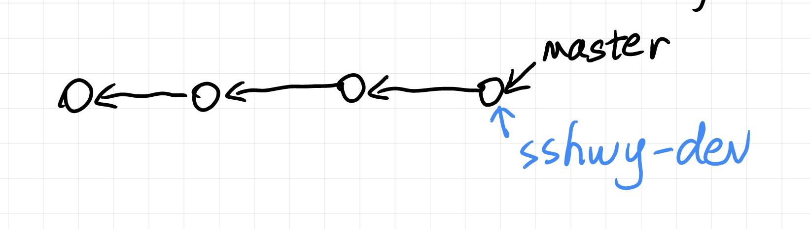
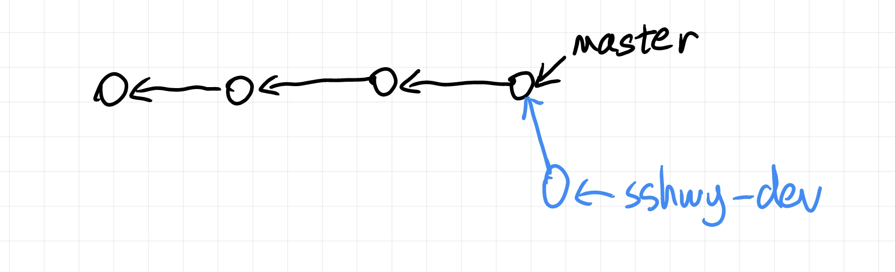
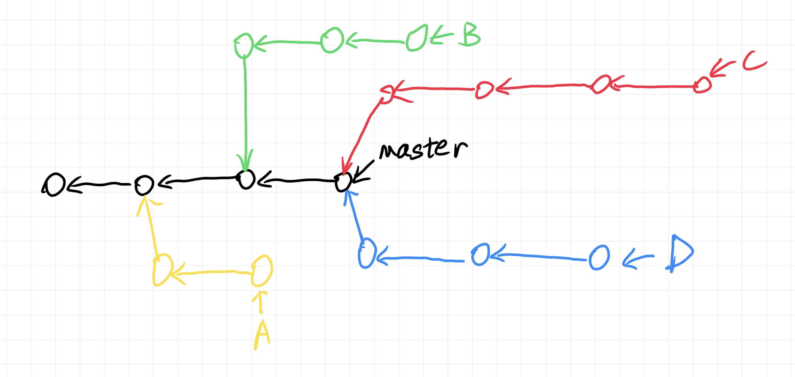
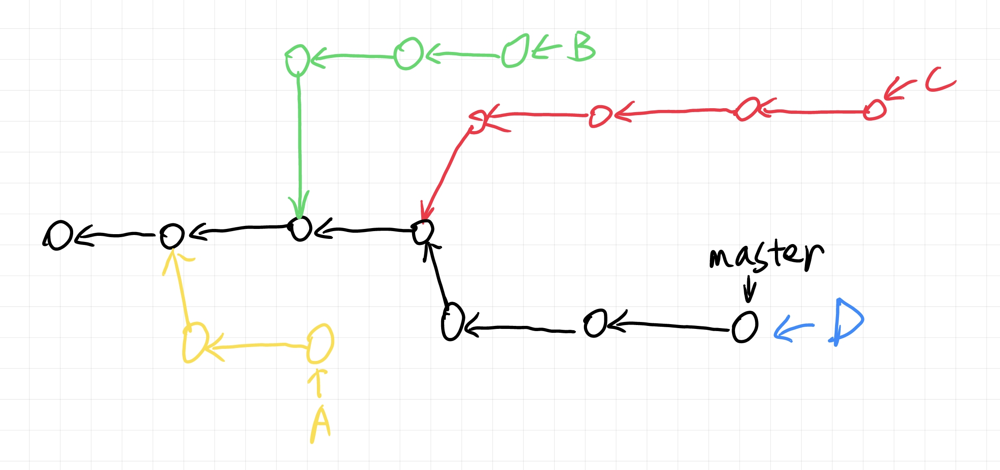
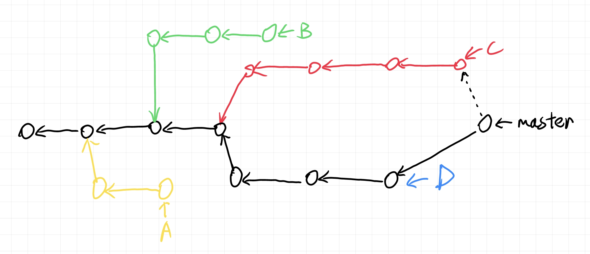
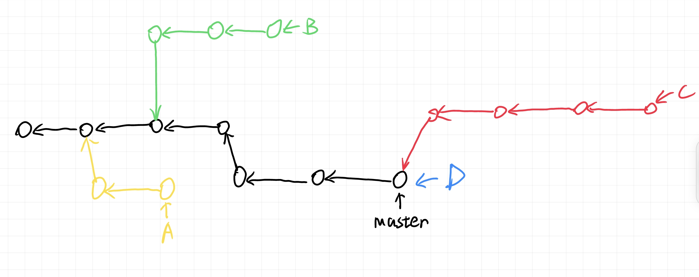
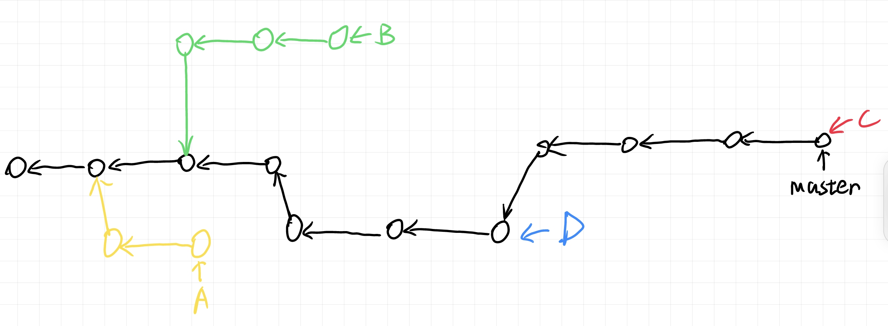

## How to Contribute

- [如何撰写项目文档](https://blog.guillaume-gomez.fr/articles/2020-03-12+Guide+on+how+to+write+documentation+for+a+Rust+crate)
- [如何撰写 macro](https://doc.rust-lang.org/reference/macros-by-example.html)
- 生成文档：`cargo doc --no-deps --open`
- 如何测试：`cargo test --tests`，或者使用 `cargo test --tests -- --nocapture` 来显示测试时的调试输出。

### Download Rust Nightly for Code Coverage (Not required)

```bash
rustup toolchain install nightly
rustup default nightly # 设置默认工具链
rustup default stable # 切换回稳定版
```

guidelines: [Instrumentation-based Code Coverage](https://doc.rust-lang.org/rustc/instrument-coverage.html)

briefly:

```bash
cargo clean

RUSTFLAGS="-C instrument-coverage" \
    LLVM_PROFILE_FILE="sandbox.profraw" \
    cargo test -p sandbox --lib --tests

llvm-profdata merge -sparse sandbox.profraw -o sandbox.profdata

llvm-cov show \
    $( \
      for file in \
        $( \
          RUSTFLAGS="-C instrument-coverage" \
            LLVM_PROFILE_FILE="sandbox.profraw" \
            cargo test -p sandbox --lib --tests --no-run --message-format=json \
              | jq -r "select(.profile.test == true) | .filenames[]" \
              | grep -v dSYM - \
        ); \
      do \
        printf "%s %s " -object $file; \
      done \
    ) \
  --instr-profile=sandbox.profdata --summary-only \
  --ignore-filename-regex='/.cargo/registry'
  # and/or other options

# 也可以先 build 再手动执行
llvm-cov report \
    --use-color --ignore-filename-regex='/.cargo/registry' \
    --instr-profile=sandbox.profdata \
    --object target/debug/deps/sandbox-33088a01f9584a57
# --object 可以多次指定
```


### Development Tools

- 请使用 VS Code 作为编辑器，并安装 rust-analyzer 插件。
- 请掌握 Git 的基本用法，（配合 SSH key 验证的使用）。可以安装 Git Graph 插件。

tools 包含一些开发工具，可以在该目录下执行

```bash
cargo build
cargo install --path . --force
```

### How to use Git

任何时候，**不要直接将提交上传到 master 分支**，即不要直接 `git push origin master`，也不要直接 `git push`（如果你不知道 `git push` 的默认分支是什么的话）。

请遵循 [Conventional Commits 规范](https://www.conventionalcommits.org/zh-hans/v1.0.0/) 填写 commit 信息。

使用 `git status` 命令可以查看当前的提交情况，使用 `git log` 命令可以查看提交日志，`git show-branch` 可以查看当前分支的信息。

一个正常的开发流程如下：

- 使用 `git checkout -b sshwy-dev master` 创建一个新的名为 sshwy-dev 的分支（分支名字可以改），完成后你会发现 VS Code 左下角状态栏上提示的 git 分支变成了 sshwy-dev。
- 然后做你要做的修改，并提交（可以将不同的修改分成多次提交）。这些提交都会落在 sshwy-dev 分支上，不会影响 master 分支。同时，如果你有未提交的**暂存提交**，那么你会发现 VS Code 左下角的状态栏显示的是 sshwy-dev\*，表示你还有未提交的修改。使用 VS Code 图形化界面的按钮可以代替执行 Git 命令。
- 在任何时候，你都可以执行 `git push origin sshwy-dev` 来将本地的 sshwy-dev 分支同步到远程（即 origin 对应的仓库）的 sshwy-dev 分支。
- 本次修改完后，先与远程的 sshwy-dev 同步（push 上去），然后在 github 网站上操作，新建一个 Pull Request。base 选择 master，compare 选择 sshwy-dev 分支，表示你想要将 sshwy-dev 分支中的提交合并到 master 上。
- 然后等待审核，等待 Pull Request 被并入 master 分支。此时远程的 master 分支（origin/master）就会更新。
- 在本地的仓库中执行 `git checkout master`，可以切换到 master 分支（注意，你需要保证没有未提交的修改，此命令才会执行成功）。然后执行 `git pull origin master`，就可以将远程仓库的修改同步到本地仓库。
- 对于下一次的开发，不要使用之前的 sshwy-dev 分支，而是重新开一个分支，例如 sshwy-dev-2。分支的命名可以考虑与你要实现的功能有关，比如 sshwy-prob-data，sshwy-contest-manage 之内的。使用 `git branch -D` 命令可以删除某个分支。

在合并你的修改分支前，请使用 [git rebase](https://git-scm.com/docs/git-rebase) 命令将修改分支的基础设为 master 的最新提交。

### Project management

要新建模块，请使用 `cargo new <模块名称> --lib` 命令，并在本目录下的 Cargo.toml 的 members 中添加上对应的文件夹名字。`--lib` 指创建一个库项目，而不是可执行文件项目。本项目只包含 ZROJ 的核心库，除了 `tools` 之外不应当有任何可执行文件的子项目。为简化版本管理，请继承 workspace 的版本号，简单来说你需要将新建项目的 `Cargo.toml` 内容修改为

```toml
[package]
name = "模块名称，通常不用修改它"
version.workspace = true
edition.workspace = true

# See more keys and their definitions at https://doc.rust-lang.org/cargo/reference/manifest.html

[dependencies]
```

为了降低开发难度，请大家用**中文或者英文**为自己编写的公开的函数、结构体和 traits 提供描述和注意事项。

每个模块 dependencies 应当分开管理，也就是说在对应的模块子目录下调用 `cargo` 命令。项目根目录下的 `Cargo.toml` 应当只用于公共的依赖（这些依赖需要在商讨后再确定）。

同理，每个模块的版本号也当分开管理。

使用 `cargo clean` 来删除构建的内容。

## 交叉编译

- 使用 `rustc --print target-list` 查看可选 target
- 使用 `rustup target add x86_64-pc-windows-gnu` 安装交叉编译的环境
- 使用 `cargo build -p sandbox --lib --target x86_64-pc-windows-gnu --release` 进行交叉编译
- 详见 [cargo build compilation options](https://doc.rust-lang.org/cargo/commands/cargo-build.html#compilation-options)

## Appendix: What is branch and How to merge elegantly

简单来说，一个分支是一个链表的表头，指向这个分支的最后一次（最新）提交。

一个分支的基点（base tip）是在它被创建时指定的。如果直接执行 `git checkout -b sshwy-dev master`，表示基于本地的 master 的最新提交创建一个名为 sshwy-dev 的分支：



而当你在这个分支做了一次提交之后，它就会变成这样：



这个是本地的仓库，远程仓库目前还没有这个分支，你 push 上去后就有了。

所以说当多个人同时修改项目的时候，远程仓库可能会长这样：



那么合并的时候该怎么做呢？假设我们先把 D 分支合并上去，那么合并完之后就会变成



接下来假设我们要合并 C 分支，那么第一种方法是直接合并。如果要手动合并，那么你首先需要将本地仓库对应的分支与远程仓库同步，然后在 master 分支下（先 `git checkout master`）执行 `git merge C `，并解决相应的冲突（如果有）：



但是这样会导致我们的提交信息里多了一个 Merge 信息（不好看），而且会导致贡献不再是一个线性的记录。因此我们需要首先在 C 分支下（`git checkout C`）执行 `git rebase master` 命令，这样 C 分支的基点就会变成现在的 master 的最新提交（如果有冲突的话会让你解决）：



然后再与 master 合并即可（这样的操作也被称作 rebase and merge，在 github 的 Pull Request 界面中可以直接点击相应按钮）：



其余分支同理。

完了之后记得 `git pull master`，保持本地 master 分支与 origin/master 分支相同。